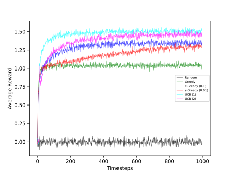

# bandit.rl

k-armed bandit test bed for reinforcement learning

## comparison of various learning methods

the following plot illustrates the performance of various learning agents on a
10 armed stochastic, stationary bandit test bed

